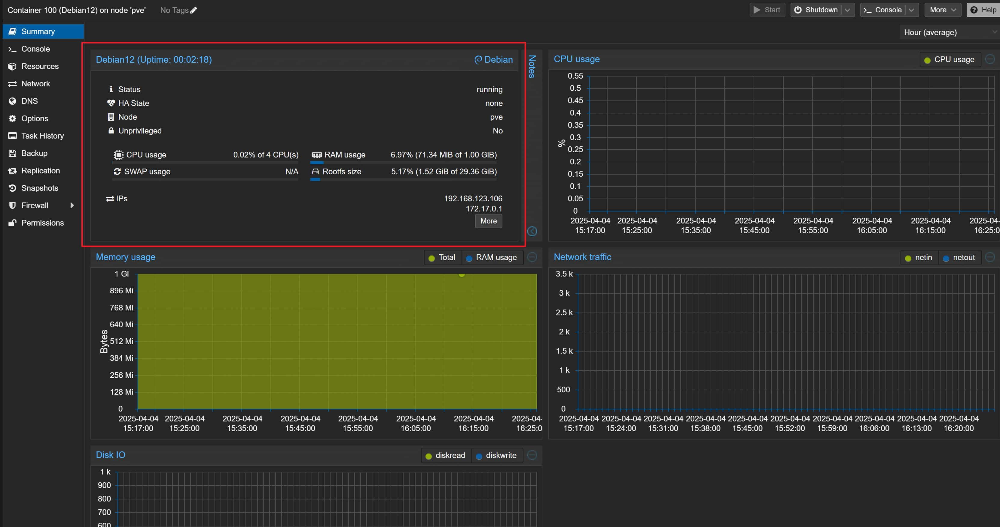
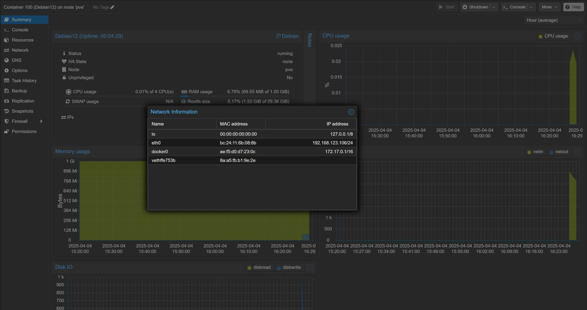

# Patches for PCT/PVE 8

用于改进 PCT/PVE 8 的补丁脚本：

1. 让 PCT 支持 OCI 类型容器，以支持启动 Redroid 容器
2. 为 PCT WebUI 添加 IP 信息面板，方便查看容器 IP 信息

---

中文 | [English](README.md)

## 0. 警告信息

> [!IMPORTANT]
> 在脚本修改后，会对部分 LXC 容器产生影响，如：在 Debian LXC 容器中运行 Docker 或挂载 NFS  
> 为避免发生此类影响，请不要将 Redroid LXC 容器设为**开机自启动**  
> 如果不想手动设置自启动，请在 PVE 系统首次运行后先创建一个标准 VM 容器，后再创建 Redroid LXC 容器

> [!WARNING]
> 1. PVE 集群模式：本脚本尚未在集群环境中测试，不建议在集群模式中使用  
> 2. 兼容性：本脚本仅在**全新安装**的 `PVE 8.2 ~ 8.4` 系统上测试并通过  
>    在其他版本或非全新安装的 PVE 使用脚本中可能存在未知问题  
>    未在 ARM64 架构的 PVE 上测试，不建议 ARM64 版本 PVE 用户使用  
> 3. 如使用需要更新脚本，请先**撤销脚本修改**，再更新脚本

> [!CAUTION]
> 1. 如果曾使用过与 LXC/PCT 相关的脚本后，再使用本脚本可能会导致不可预估的问题（反之亦然）。  
> 2. 使用本脚本前，请备份重要数据。脚本导致的一切数据丢失，由使用者承担，运行脚本视为同意该声明！  
> 3. 使用本脚本修改后，请不要更新 PVE 版本，如需要更新 PVE 版本前请务必恢复修改，避免意外发生

## 1. 为 PCT 添加 OCI 类型容器支持

> [!Tip]
> 推荐使用全新安装 PVE 8.2+ 系统

### 1.1 使用方法

在 PVE 主机上 `控制台(Shell)` 中输入并运行

```bash
wget -q https://raw.githubusercontent.com/lurenJBD/PCT-patches/refs/heads/pve-8/Patch-for-PCT-to-support-oci.sh
bash Patch-for-PCT-to-support-oci.sh -c
```

如需撤销脚本修改，请输入并运行

```bash
bash Patch-for-PCT-to-support-oci.sh -c -R
```

### 1.2 支持传入的参数

用法: `Patch-for-PCT-to-support-oci.sh [选项]`

| 选项               | 描述                     |
| ------------------ | ------------------------ |
| `-h, --help`       | 显示此帮助信息           |
| `-R, --restore`    | 恢复原始文件             |
| `-D, --del-backup` | 恢复后删除备份文件       |
| `-y, --yes`        | 跳过确认提示             |
| `-c, --chinese`    | 使用中文显示消息（默认） |
| `-e, --english`    | 使用英文显示消息         |

### 1.3 PCT 功能支持

- [x] 快照 (Snapshots)
- [x] 备份 (Backup)
- [x] 防火墙 (Firewall)
- [x] 模板 (template) + 完整克隆 (Full Clone)
- [ ] 模板 (template) + 链接克隆 (Linked Clone)

---

> [!CAUTION]
> 1. 创建 Redroid LXC 容器后，容器选项中 **OS 类型** 非 `OCi`，或无 `lxc.init.cmd` 和 `Ixc.mount.auto` 参数  
>    请先刷新 PVE WebUI，确认是否有变化，如果依然无变化，请尝试重启 PVE ，如重启后问题依然没得到解决  
>    请撤销脚本修改后重启 PVE，重新运行脚本后再次重启 PVE 后，再尝试新建 Redroid LXC 容器  
> 2. 若无法确认是否成功，可[查看部署成功截图](#为-oci-类型容器添加的-apparmor-profile-lxcinitcmd-和-ixcmountauto-参数后两者仅限-oci-容器使用)来辅助确认

## 2. 创建 Redroid LXC 容器

> [!IMPORTANT]
> 创建容器时需取消勾选**非特权容器 (Unprivileged container)**

从 [`Release`](https://github.com/lurenJBD/PCT-patches/releases) 中选择一个模板下载，推荐使用 [`lineage19.1-x86_64-houdini-magisk-gapps.tar.gz`](https://github.com/lurenJBD/PCT-patches/releases/download/lineage/lineage19.1-x86_64-houdini-magisk-gapps.tar.gz)

### 2.1 初始化容器

分配 `rootfs` 的空间不低于 `5GB`；内存不小于 `4GB（4096MB）`；关闭 `Swap`，即填写 `0`

| 需设置的参数 | 设置的值   |
| ------------ | ---------- |
| `rootfs`     | `≥ 5GB`    |
| `内存`       | `≥ 4096MB` |
| `Swap`       | `＝ 0`     |

### 2.2 配置网络

> [!Tip]
> 如果想禁用 IPv6，请在 `lxc.init.cmd` 参数中添加 `androidboot.disable_ipv6=1` [仅限 Lineage 模板支持]

`IPv4` 选择 `DHCP`，无论 `IPv6` 选那个选择 Redroid 容器 都会获得一个无状态 IPv6 地址

### 2.3 添加用户数据存储空间

创建完成容器后，在 `资源(Resouces)` 内点击 `添加(Add)` 添加一个 `挂载点(Mount Point)` ，在 `路径(Path)` 中填写 `/data`，硬盘推荐不小于 `25G`

| 需设置的参数 | 设置的值 |
| ------------ | -------- |
| `路径`       | `/data`  |
| `磁盘大小`   | `≥ 25G`  |

### 2.4 [可选]配置显卡加速

> [!NOTE]
> 这个参数等效于手动向配置文件里写 `lxc.mount.entry: /dev/dri dev/dri none bind,optional,create=dir`

> [!Tip]
> 若提示无显卡，请尝试`更新 PVE 设备 ID 数据库` 以及 `更新 PVE 显卡驱动`，然后重启 PVE 宿主机后再试

点击 `添加(Add)` 添加一个 `Mount Entry`，在 `Soucre Path` 中填入 `/dev/dri`，在 `Target Path` 中填入 `/dev/dri`，`Create Type` 选 `dir`

| 需设置的参数  | 设置的值   |
| ------------- | ---------- |
| `Soucre Path` | `/dev/dri` |
| `Target Path` | `/dev/dri` |
| `Create Type` | `dri`      |

> [!IMPORTANT]
> 现在 PCT 已经会针对 OCI 类型容器 自动配置，选项(Options) 中的`lxc.init.cmd` 和 `Ixc.mount.auto` 参数不需要再手动配置

关于 `lxc.init.cmd` 的更多参数，请前往 [redroid-doc](https://github.com/remote-android/redroid-doc?tab=readme-ov-file#configuration) 查看

#### 2.5 效果截图

##### 为 OCI 类型容器添加的 `Mount Entry` 功能（仅限 OCI 容器使用）


##### 为 OCI 类型容器添加的 `Apparmor profile` ，`lxc.init.cmd` 和 `Ixc.mount.auto` 参数（后两者仅限 OCI 容器使用）


---

## 3. 为 PCT WebUI 添加 IP 信息面板

支持 `PVE 8.1 ~ 8.4`

感谢 `Gabriel Goller`(来自 pve-devel) 提供的参考

### 3.1 使用方法

在 PVE 宿主机 `控制台(Shell)` 中输入并运行

```bash
wget -q https://raw.githubusercontent.com/lurenJBD/PCT-patches/refs/heads/pve-8/Patch-for-PCT-WebUI-Display-IPinfo-beta.sh
bash Patch-for-PCT-WebUI-Display-IPinfo-beta.sh
```

如需撤销脚本修改，请输入并运行

```bash
bash Patch-for-PCT-WebUI-Display-IPinfo-beta.sh -R
```

#### 3.2 效果截图

##### PCT 主界面显示 IP 信息



##### IP 信息详细



---

# 鸣谢

感谢以下开发者对本项目作出的贡献:

[](https://github.com/lurenJBD/PCT-patches/graphs/contributors)
